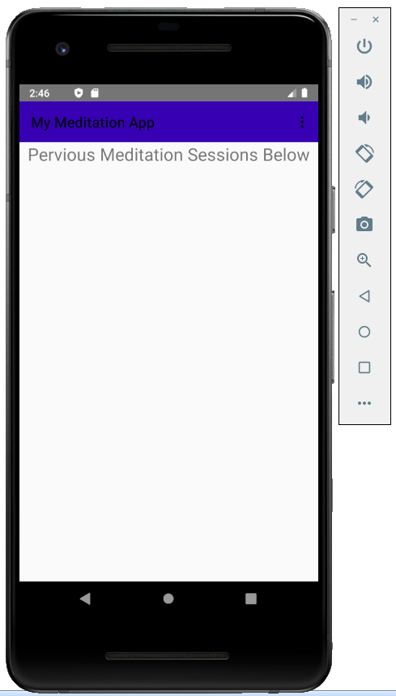
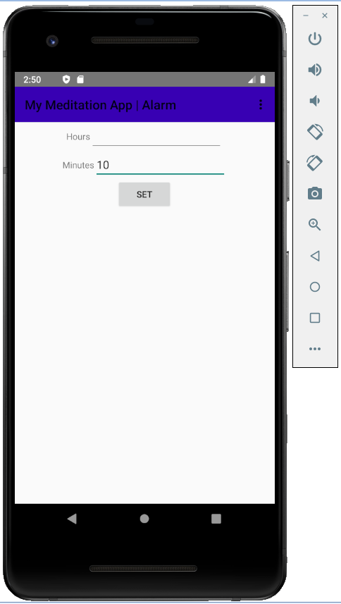

# MeditationAppv1

The Meditation App that lets you set an alarm for how long you want to meditate and vibrates when it is time. It also records the alarm data to be seen on the home page table of the app. To meditate properly you should meditate daily so I chose to have your data saved to a file to be shown on the home page as to keep track of your meditation tendencies. I also chose to have it vibrate to make sure you get the alarm when you have your eyes are closed during meditation. I made sure you cannot input incorrect numbers for hours and minutes when setting up your Alarm. 

Instructions
When you open up the app you will see the home page.

 To get to the alarm set page you will use the navigation bar buttons to show the screen options and choose the alarm set page.
On the alarm page once inputted the hours and minutes and pressed set. The current date, time and amount of time is saved to a database file to be viewed later on a table on the home page. 

This will bring you to the alarm clock to count down and setup a notification to start when alarm is complete.

When complete there will be buzzing the phone letting you know the alarm went off.